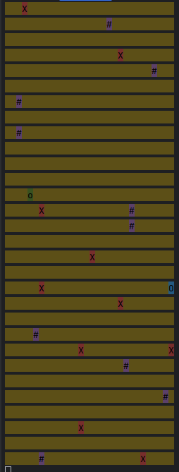

# Игра "Преследование"
Проект представляет собой консольную игру (дада консольная игра на java) созданная с использованием Maven.
- 

## Обозначения:
- `o` - позиция игрока на карте.
- `#` - препятствие.
- `x` - враг (искусственный интеллект).
- `O` - целевая точка, к которой игрок должен добраться, прежде чем враги достигнут игрока. Игрок считается достигшим целевой ячейки, если он наступил на её позицию.


## Правила игры:
1. Каждый участник (игрок и враги) может сделать один ход. Затем наступает очередь другого участника. Враг считается достигшим игрока, если он может наступить на позицию игрока в текущем ходе.
2. Доступные направления движения - влево, вправо, вниз и вверх.
3. Если враг не может двигаться вперед (вокруг него есть препятствия или другие враги, или он достиг края карты), враг пропускает ход.
4. Целевая точка является препятствием для врага.
5. Если игрок не может двигаться вперед (окружен препятствиями, врагами или достиг края карты), игрок проигрывает игру.
6. Игрок проигрывает, если враг находит его, прежде чем он достигнет целевой точки.
7. Игрок начинает игру первым.

## Запуск игры:
- для запуска игры необходимо располагаться в папке Game
- Соберите исполняемый файл командой `mvn clean install`
- Размер поля, количество препятствий и количество врагов вводятся в программу с использованием параметров командной строки:
   ```bash
   $ java -jar game.jar --enemiesCount=10 --wallsCount=10 --size=30 --profile=production
- Если входные данные некорректны, программа выбросит неконтролируемое исключение IllegalParametersException и завершится.

## Язык проекта - Java
## Использованные технологии:
Maven
JCommander
### Требуемые доработки
Подумать над структурой кода, и, возможно внести изменения.